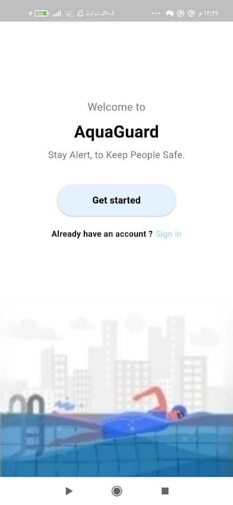
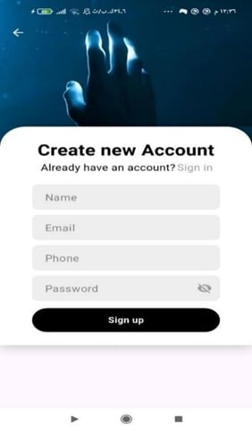
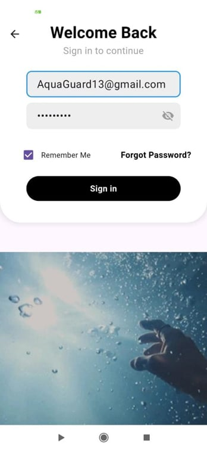
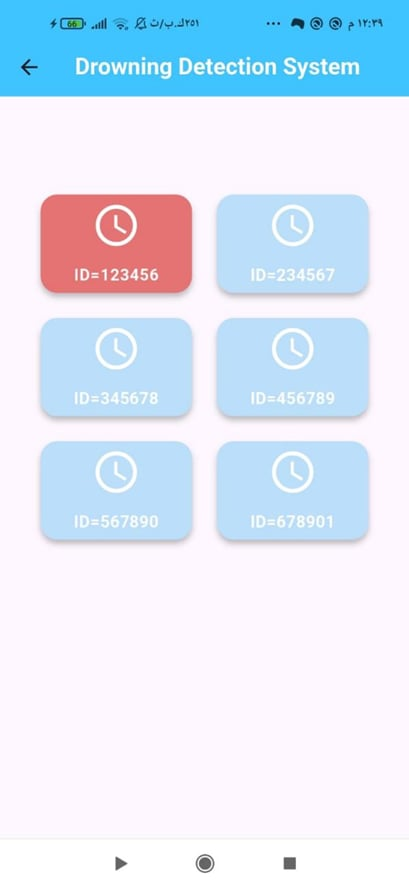
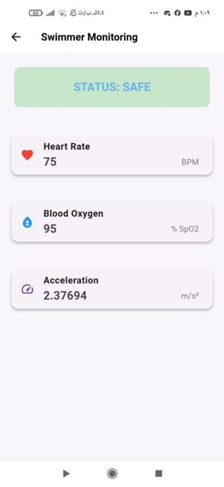

# Senior_project
# Drowning Detection Mobile Application:
A smart mobile application designed to help lifeguards monitor swimmers in real time using wearable devices.
The application provides instant visual and audible alerts when drowning signs are detected, helping improve swimmer safety inside pools.

# Application Features:
  Lifeguard authentication (Sign Up / Sign In)
  Real-time swimmer monitoring
  Live heart rate monitoring
  Blood oxygen monitoring (SpO2)
  Acceleration tracking
  Visual and audible drowning alerts
  Firebase Realtime Database integration
  Continuous real-time data updates
  
# Technologies Used:
Flutter
Dart
Firebase Realtime Database
Firebase Authentication

# Application Screens:
 Welcome Screen

The first screen displayed when the application starts.

  

 Sign Up Screen

Allows lifeguards to create a new account.

  

 Sign In Screen

Allows lifeguards to log into the application securely.

  

 Dashboard Screen

Displays all wearable devices connected to swimmers in the pool.

🔵 Blue Card → Swimmer is safe
🔴 Red Card → Drowning alert detected

When drowning signs are detected:

Audible alarm is triggered
Visual warning appears immediately

  

 Wearable Device Readings Screen 

Displays real-time sensor readings for a selected swimmer:
Heart Rate ,
Blood Oxygen Level (SpO2) ,
Acceleration ,
Current Status

  

The application continuously listens to Firebase Realtime Database and updates the data instantly.

  

